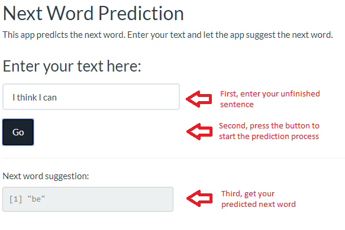

Capstone Project - App for Next Word Prediction
========================================================
author: pf
date: August 31, 2017
autosize: true

This presentation will briefly explain an app to predict 
the next word as well as the model and methods it uses
for prediction. This app is the capstone project for the
Data Science Specialization course from Johns Hopkins 
University. 

Objective of the Capstone Project
========================================================

The goal of the capstone project is to build a model to 
predict the next word in a unfinished sentence and to present
this model as an application. 

The data for training the predictive model is from a corpus 
called [HC Corpora](https://web-beta.archive.org/web/20161014134025/http://www.corpora.heliohost.org:80/index.html). It is collected from publicly 
available sources (news, blogs, twitter).

The different sub tasks are data cleaning, exploratory analysis,
model building and improvement, application programming and
presentation.

Methods and Models
========================================================

First, a 5% random sample of the data was created.

Second, the data was cleaned: Non-English characters, numbers, white spaces, brackets and punctuation and profanity were removed. Words were converted to lower case, abbreviations replaced with long form.

Third, the sample was tokenized into [n-grams](https://en.wikipedia.org/wiki/N-gram).

Then, the uni-, bi-, tri- and quadrigrams were used to train a back-off model with 
[stupid backoff smoothing](http://www.aclweb.org/anthology/D07-1090.pdf).

Finally, this model was made available through an application to predict the 
next word. 

The Application's Manual
========================================================

The user types some text into the text box, presses "Go" and gets the next word prediction immediately. [Here](https://pfeubli.shinyapps.io/prediction/) is the app.

Links and References
========================================================

The app is available under: [https://pfeubli.shinyapps.io/prediction/](https://pfeubli.shinyapps.io/prediction/)

All files used for the app as well as the milestone report and this presentation
are available on [github](https://github.com/pfeubli/capstone).

Useful references:
- [Speech and Language Processing](http://www.deepsky.com/~merovech/voynich/voynich_manchu_reference_materials/PDFs/jurafsky_martin.pdf)
- [Text Mining Infrastructure in R](http://www.stat.wvu.edu/~jharner/courses/dsci503/docs/tm.pdf)
- [Stupid Backoff Smoothing](http://www.aclweb.org/anthology/D07-1090.pdf)
- [ANLP Package](https://cran.r-project.org/web/packages/ANLP/ANLP.pdf) 
- [ANLP Package Details](https://github.com/achalshah20/ANLP/blob/master/R/ANLP.R)
